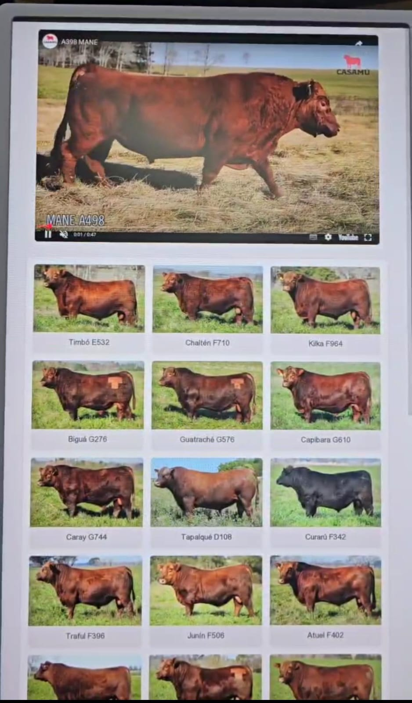

# 🐄 Catálogo Interactivo para Remates Ganaderos

Aplicación web desplegada en producción para **Origen Rural**, productora audiovisual con presencia televisiva regional. Permite a los asistentes de exposiciones ganaderas explorar lotes por categoría, ver miniaturas dinámicas y reproducir videos en tiempo real.

  

---

## 🏆 Eventos donde fue utilizada

| Evento | Lugar | Fecha |
|--------|-------|-------|
| Semana Angus de Primavera (Expoagro) | Cañuelas, Buenos Aires | Septiembre 2025 |
| 10° Venta Anual de Máxima Selección Genética | Sociedad Rural de Tandil | Septiembre 2025 |
| SELECTA — Gran Venta Selección de Lotes Especiales | Arena Angus, Cañuelas | Agosto 2025 |
| Remate Rústicos Especial Fin de Año | Claromecó | Noviembre 2025 |
| Remate Cuarta Edición Destete de Primavera | La Rural, Tres Arroyos | Noviembre 2025 |

---

## 📱 Interfaz

  

---

## ✨ Características principales

- 📋 Entre 15 y 20 categorías de lotes navegables
- 🎥 Reproducción directa de videos vía YouTube API
- 🔎 Organización por categorías con miniaturas dinámicas
- 📱 Optimizada para pantallas táctiles de 27"
- ⚡ Desplegada en GitHub Pages — accesible desde cualquier navegador

---

## 🛠️ Tecnologías utilizadas

- **Frontend:** HTML, CSS, JavaScript
- **API:** YouTube Data API
- **Deploy:** GitHub Pages

---

## 🚀 Demo en vivo

[Ver catálogo](https://boninifranco.github.io/Demo-Remates/)
